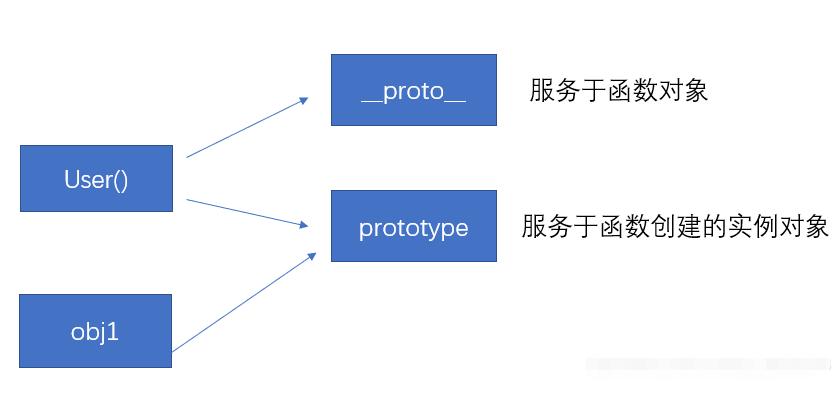
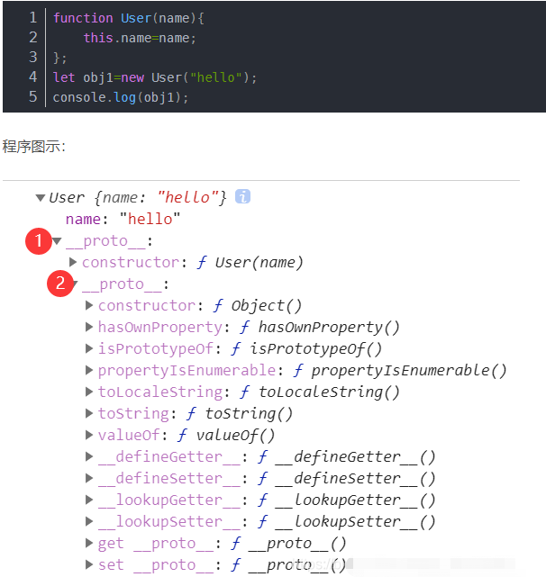

# 什么是 JavaScript ？
## 参考资料[《所以 JavaScript 到底是什么？我居然懵了??》](https://segmentfault.com/a/1190000037516367 "所以 JavaScript 到底是什么？我居然懵了??")

### 前言
引用《JavaScript 高级程序设计第四版》中说的话，“从简单的输入验证脚本到强大的编程语言，JavaScript 的崛起没有任何人预测到。
它很简单，学会用只要几分钟；它又很复杂，掌握它要很多年。要真正学好用好 JavaScript，理解其本质、历史及局限性是非常重要的”。

### JavaScript 是脚本编程语言
1995年网景公司为来额解决页面中`简单的表单验证时客户端和服务端通信时延`推出了一款叫做 JavaScript 的客户端脚本语言  
后来微软针对此决定向IE投入更多资源，针对性的推出了 JScript  
后来 Ecma（欧洲计算机制造商协会）推出 ECMAScript 的国际化标准了两门语言

### JavaScript 是弱类型语言
这意味着变量可以被隐式的转换为另一个类型  
虽然类型的隐藏转换给 JavaScript 增加了一定的灵活性，但是也同时增加了规则的复杂度和一定的风险  
+ 二元运算符`+`会把两个操作数转换为字符串，这是因为`+`也可以用来连接字符串  
+ 二元运算符`-`会把两个操作数转换为数字  
+ 一元运算符`+ -`都会把操作数转换为数字 

```
console.log(1 + '2' === '12')
console.log('3' - '1' === 2)
console.log(+'2' === 2)
console.log(-'1' === -1)
```

### JavaScript 是动态类型的
和大部分脚本语言一样，其类型与值不是与变量关联的，变量可以为数值又可以被赋值字符串  
可以在运行时直接执行 JavaScript 语句

### JavaScript 是单线程的
JavaScript 需要和页面进行交互，操作DOM等，如果是多线程会带来很多问题  
比如如果有两个线程同时在 JavaScript 中，一个线程删除了某个DOM，另一个线程又在这个节点上添加内容，那么以谁为准呢  
这决定了它只能是单线程的

### JavaScript 是解释型语言
解释型语言（英语：Interpreted language）是一种编程语言类型  
这种类型的编程语言会将代码一句句直接运行，不需要像编译型语言（Compiled language）一样，经过编译器先行编译为机器代码，之后再运行

### JavaScript 具有良好的跨平台性
在绝大多数浏览器支持下，可以在多种平台下运行

### JavaScript 和 ECMAScript 有什么区别？以及和DOM、BOM的关系？
简而言之后三者都是 JavaScript 的组成部分  

### 什么是 DOM ？
DOM（文档对象模型），提供了与网页内容交互的 方法 和 接口  
DOM 将整个页面抽象为一组分层节点，HTML或XML页面的每个组成部分都是一种节点，包含不同的数据  
DOM 通过创建表示文档的树，让开发者可以随心所欲地控制网页的内容和结构  
使用 DOM API 可以轻松的删除、添加、替换、修改节点  

### 什么是 BOM ？
BOM（浏览器对象模型），提供了与浏览器交互的 方法 和 接口  
BOM 主要是针对浏览器窗口和子窗口（frame），使用 BOM API ，开发者可以操作浏览器显示页面之外的部分  
+ 弹出新浏览器窗口的能力
+ 移动、缩放和关闭浏览器窗口的能力
+ navigator 对象，提供关于浏览器的详尽信息
+ location 对象，提供浏览器加载页面的详尽信息
+ screen 对象，提供关于用户屏幕分辨率的详尽信息
+ performance 对象，提供浏览器内存占用、导航行为和时间统计的详尽信息
+ 对浏览器存储相关的操作比如 cookies、sessionStorage 、localStorage 等
+ 其他自定义对象，如 XMLHttpRequest 和 IE 的 ActiveXObject

### 什么是 ECMAScript ？
ECMAScript 描述了 JavaScript 的语法和基本对象  
+ 语法
+ 类型
+ 语句
+ 关键字
+ 保留字
+ 操作符
+ 全局对象  

一句话描述就是，ECMAScript 是一套规范，JavaScript 则是 ECMAScript 一种实现  
为什么说是一种实现呢，因为 Adobe ActionScript 同样也实现了 ECMAScript，JScript 也同样实现了 ECMAScript

### 什么是闭包？
变量的作用域有两种：全局变量和局部变量  
函数内部可以直接读取全局变量  
在函数外部无法读取函数内的局部变量  
能够读取其他函数内部变量的函数，就是闭包  
可以把闭包简单理解成***定义在一个函数内部的函数***
在本质上，闭包就是将函数内部和函数外部连接起来的一座桥梁  

```
function f1() {
	var n = 999;
	function f2() {
		alert(n);
	}
	return f2;
}
var result = f1();
result(); // 999
```

### 闭包的作用？
+ 读取函数内部的变量  
+ 让这些变量的值始终保持在内存中，因为局部变量在函数调用玩之后，就会被销毁不会存在内存中  

### 函数声明的相关知识点
函数内部声明变量的时候，一定要使用var命令  
如果不用的话，你实际上声明了一个全局变量

[闭包相关资料学习自 -> 阮一峰的博文'学习Javascript闭包（Closure）'](http://www.ruanyifeng.com/blog/2009/08/learning_javascript_closures.html "学习Javascript闭包（Closure）")

### 什么是原型和原型链？
Javascript 只有一种结构，那就是：对象  
在 javaScript 中，每个对象都有一个指向它的原型（prototype）对象的内部链接  
这个原型对象又有自己的原型，直到某个对象的原型为 null 为止（也就是不再有原型指向），组成这条链的最后一环  
这种一级一级的链结构就称为原型链  
简单来说，原型就是JS继承的基础  

### 关于原型的相关知识点
+ 每个函数都有个prototype属性，它指向空的Object对象（原型对象）
+ 原型对象中包含constructor属性指向构造函数

### 什么对象没有原型？
+ 完全的数据字典，使用`Object.create()`方法创建一个新对象
+ 使用现有的对象来提供新创建的对象的`__proto__`

### prototype 和 `__proto__` 的区别
+ 每个函数都有一个prototype即显式原型属性（原型对象，函数定义时添加此属性）
+ 每个实例对象都有一个`__proto__`即隐式原型属性（创建实例对象时添加此属性）
+ 实例对象的`__proto__`（隐式原型）等于其构造函数的prototype（显式原型）

```
// 对象的隐式原型=构造函数的显式原型
function User() {};
let obj1 = new User(); // Object
console.log(obj1.__proto__ == User.prototype) // true
console.log(obj1.prototype == User.prototype) // false
```



### 关于原型链的知识点
+ 对象中方法的优先级高于原型中方法的优先级
+ 如果创建的实例对象调用某个方法，会先去对象中找，若没有去该对象的原型对象（父亲）中找



### console.log() 和 console.dir() 的区别
+ `console.log()`会在浏览器控制台打印出信息
+ `console.dir()`可以显示一个对象的所有属性和方法

[原型、原型链相关资料学习自 -> 彻底理解什么是原型、原型链'](https://blog.csdn.net/qq_45731083/article/details/113406394 "彻底理解什么是原型、原型链")