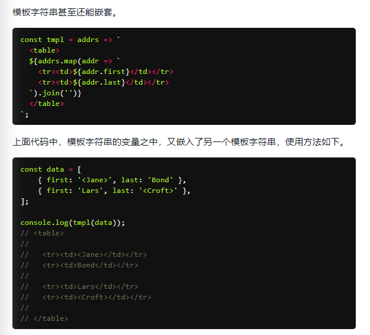
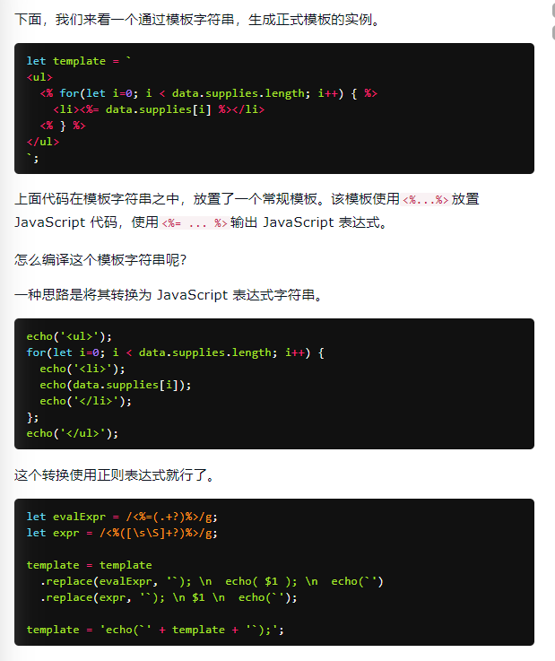
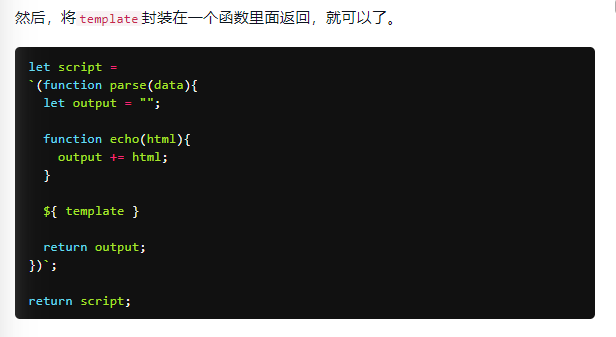
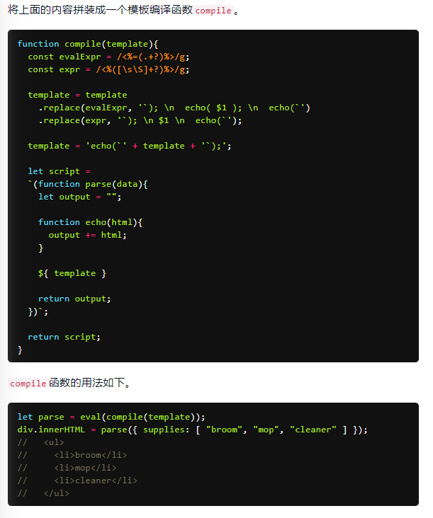
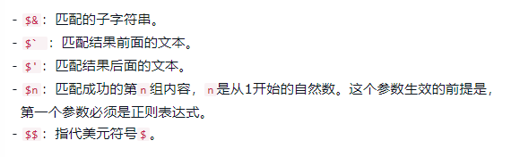
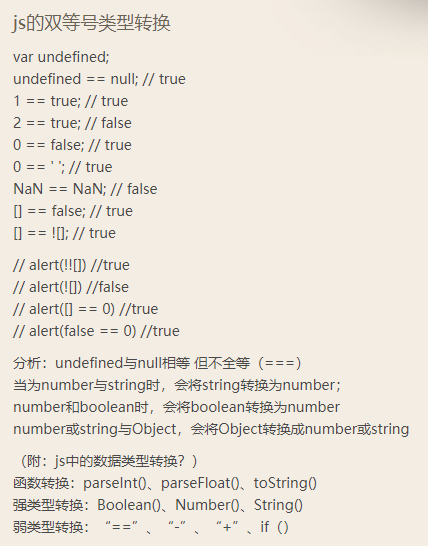

# ES6 学习笔记
## 第一阶段是快速过一遍简要记录下，第二阶段详细写笔记，参考资料[《ES6 入门教程》](https://es6.ruanyifeng.com/ "ES6 入门教程")
## 当前进度已完成至`13.Set和Map数据结构`，下次看`7.函数的拓展`和`12.Symbol`，由于函数比较繁杂放到后面看，暂时跳过看`9.数组的拓展`和`10.对象的拓展`，[点击这里直接跳转](#jumpId)
## 注意复习！！！

## ES6主体介绍
### ECMAScript和JavaScript的关系？

### ES6的简史；ES5和ES6的区别；2013年ES6草案冻结，2015年ES6正式通过
PS：ES6 既是一个历史名词，也是一个泛指，含义是 5.1 版以后的 JavaScript 的下一代标准，涵盖了 ES2015、ES2016、ES2017 等等  
	而 ES2015 则是正式名称，特指该年发布的正式版本的语言标准  
	本书中提到 ES6 的地方，一般是指 ES2015 标准，但有时也是泛指“下一代 JavaScript 语言”。  

### Babel转码器；主要用于将ES6转译为ES5

### let命令；声明变量的技巧；避免变量提升；具有暂时性死区的特性；不允许重复声明

### ES6中的块级作用域与函数声明；虽然有规则但是为了老代码的兼容实际上做了一定妥协

### 立即执行函数表达式（匿名 IIFE）

### const命令；声明一个只读的常量，声明时就要赋值且之后不能再改变；const实际上保证的，并不是变量的值不得改动，而是变量指向的那个内存地址所保存的数据不得改动

### ES6声明变量的六种方法

### 顶层对象属性存在的问题以及ES6解决的方式

### globalThis对象以及设计这个对象的原因；ES2020 在语言标准的层面，引入globalThis作为顶层对象

### 变量的解构赋值；ES6 允许按照一定模式，从数组和对象中提取值，对变量进行赋值，这被称为解构（Destructuring）
+ 数组的解构赋值；模式匹配；Set结构也可以使用数组的解构赋值；只要某种数据结构具有`Iterator`接口都可以使用数组的解构赋值；解构赋值允许指定默认值
+ 对象的解构赋值；数据无序，对象必须要与属性同名；结构也可以用于嵌套结构；解构赋值允许指定默认值
+ 字符串的结构赋值，很有意思
+ 数值和布尔值的解构赋值，没看懂
+ 函数参数的解构赋值

### 变量解构赋值的用途；交换变量的值；从函数返回多个值；函数参数的定义；提取JSON值；函数参数的默认值；遍历Map结构；输入模块的指定方法
PS：这个最好每个都练习一下，在今后的生涯中对于自己代码的可读性非常有用

### 具有`Iterator`接口

## 字符串的拓展
### 字符串新增的内容，这一章内容比较冷门或者我原来掌握的太少，理解起来比较耗时间，后期注意一下
+ 字符的Unicode表示法，完全不懂......  
+ 字符串新增了`Iterator`遍历器接口  
+ 字符串允许直接输入字符，以及输入字符的转义形式，完全不懂......  
+ 改造了JSON.stringify()，根据标准JSON的数据必须是UTF-8编码，但是该方法现在可能会返回不符合UTF-8标准的字符串  
+ 模板字符串，是增强版的字符串，用反引号（`）标识  
	> 模板字符串的空格和换行，都是被保留的，如果你不想要这个换行，可以使用`.trim()`方法消除它  
	> 它可以当作普通字符串使用，也可以用来定义多行字符串，或者在字符串中嵌入变量  
	> 嵌入变量需要将变量名写在`${}`之中，如果模板字符串中的变量没有声明，将报错  
	> `${}`大括号内部可以放入任意的 JavaScript 表达式，可以进行运算，以及引用对象属性，如果大括号内部是一个字符串，将会原样输出  
	> 模板字符串之中还能调用函数`function fn() {return "Hello World"}	(反引号)foo ${fn()} bar(反引号)`  
	> 模板字符串甚至还能嵌套  
	  
	> 如果需要引用模板字符串本身，在需要时执行，可以写成函数  
	> 模板字符串的应用实例：模板编译  
	  
	  
	 
	> 字符串模板还可以紧跟在一个函数名后面，该函数将被调用来处理这个模板字符串，这被称为***标签模板***功能，大致明白需要详细了解......
	> ***标签模板***的一个重要应用，就是过滤 HTML 字符串，防止用户输入恶意内容，另一个应用，就是多语言转换（国际化处理）
	> 模板字符串本身并不能取代 Mustache 之类的模板库，因为没有条件判断和循环处理功能，但是通过标签函数，你可以自己添加这些功能，没看懂......
	> 可以使用标签模板，在 JavaScript 语言之中嵌入其他语言（通过jsx函数，将一个 DOM 字符串转为 React 对象），牛逼，详细了解一下......
	> 但是字符串模板也是有一定的限制的，没看懂详细了解一下......

### 字符串对象新增的方法
+ `String.fromCharCode()`，用于从 Unicode 码点返回对应字符，不懂XD......
+ `String.raw()`，返回一个斜杠都被转义（即斜杠前面再加一个斜杠）的字符串，往往用于模板字符串的处理方法，还是不懂XD，评论区说写的有问题注意看下......
+ `String.codePointAt()`，对于这种4个字节的字符，JavaScript 不能正确处理，字符串长度会误判为2，`codePointAt()`方法，能够正确处理 4 个字节储存的字符，返回一个字符的码点
+ `String.normalize()`，许多欧洲语言有语调符号和重音符号，处理这个用的，不想了解......
+ 传统上，JavaScript 只有`indexOf()`方法，可以用来确定一个字符串是否包含在另一个字符串中，ES6 又提供了三种新方法
	> `String.includes()`，返回布尔值，表示是否找到了参数字符串  
	> `String.startsWith()`，返回布尔值，表示参数字符串是否在原字符串的头部  
	> `String.endsWith()`，返回布尔值，表示参数字符串是否在原字符串的尾部  
+ `String.repeat()`，返回一个新字符串，表示将原字符串重复n次
+ ES2017 引入了字符串补全长度的功能。如果某个字符串不够指定长度，会在头部或尾部补全
	> `String.padStart()`，用于头部补全  
	> `String.padEnd()`，用于尾部补全  
+ ES2019 对字符串实例新增了`trimStart()`和`trimEnd()`这两个方法，它们的行为与`trim()`一致
	> `String.trimStart()`，用于消除字符串头部的空格  
	> `String.trimEnd()`，用于消除字符串尾部的空格  
+ `String.matchAll()`，用于返回一个正则表达式在当前字符串的所有匹配，正则的拓展对此会有详细讲解注意下......
+ `String.replaceAll()`，历史上，字符串的实例方法replace()只能替换第一个匹配，ES2021 引入了replaceAll()方法，可以一次性替换所有匹配
	> `String.prototype.replaceAll(searchValue, replacement)`  
	> searchValue是搜索模式，可以是一个字符串，也可以是一个全局的正则表达式（带有g修饰符）  
	> 如果searchValue是一个不带有g修饰符的正则表达式，replaceAll()会报错，这一点跟replace()不同  
	> replaceAll()的第二个参数replacement是一个字符串，表示替换的文本，其中可以使用一些特殊字符串  
	

## 正则的拓展
### 正则新增的内容，我想直接忽略，因为正则我完全一窍不通，后期抽空专题学习研究下

## 数值对象的拓展
### 数值对象新增的内容
+ 提供了二进制和八进制数值的新的写法
	> 前缀`0b`（或`0B`）表示二进制  
	> 前缀`0o`（或`0O`）表示八进制  
	> PS: 貌似`0x`用来表示十六进制
+ `Number.isFinite()`，用来检查一个数值是否为有限的，注意，如果参数类型不是数值，`isFinite()`一律返回false
+ `Number.isNaN()`，用来检查一个值是否为NaN，注意，如果参数类型不是NaN，`isNaN()`一律返回false
+ ES6 将全局方法`parseInt()`和`parseFloat()`，移植到Number对象上面，行为完全保持不变，这样做的目的，是逐步减少全局性方法，使得语言逐步模块化
```
	// ES5的写法
	parseInt('12.34') // 12
	parseFloat('123.45#') // 123.45

	// ES6的写法
	Number.parseInt('12.34') // 12
	Number.parseFloat('123.45#') // 123.45
```
+ `Number.isInteger()`，用来判断一个数值是否为整数，如果参数不是数值，`isInteger()`返回false
	> JavaScript 内部，整数和浮点数采用的是同样的储存方法，所以 25 和 25.0 被视为同一个值  
	> 注意，由于 JavaScript 采用 IEEE 754 标准，数值存储为64位双精度格式，数值精度最多可以达到 53 个二进制位（1 个隐藏位与 52 个有效位）  
	> 如果数值的精度超过这个限度，第54位及后面的位就会被丢弃，这种情况下，`isInteger()`可能会误判  
	> 下方代码示例第1行中，`isInteger()`的参数明明不是整数，但是会返回true,原因就是这个小数的精度达到了小数点后16个十进制位，转成二进制位超过了53个二进制位，导致最后的那个2被丢弃了 
	> 类似的情况还有，下方代码示例23行中，如果一个数值的绝对值小于Number.MIN_VALUE（5E-324），即小于 JavaScript 能够分辨的最小值，会被自动转为 0，这时，`isInteger()`也会误判  
	> 总之，如果对数据精度的要求较高，不建议使用Number.isInteger()判断一个数值是否为整数  
```
	Number.isInteger(3.0000000000000002) // true

	Number.isInteger(5E-324) // false  
	Number.isInteger(5E-325) // true
```
+ `Number.EPSILON`，在Number对象上面，新增一个极小的常量Number.EPSILON，根据规格，它表示 1 与大于 1 的最小浮点数之间的差  
	> 对于 64 位浮点数来说，大于 1 的最小浮点数相当于二进制的1.00..001(小数点后面有连续 51 个零)，这个值减去 1 之后，就等于 2 的 -52 次方  
	> `Number.EPSILON`实际上是 JavaScript 能够表示的最小精度，误差如果小于这个值，就可以认为已经没有意义了，即不存在误差了  
	> `Number.EPSILON`可以用来设置***能够接受的误差范围***  
	> 比如，误差范围设为 2 的-50 次方（即Number.EPSILON * Math.pow(2, 2)），即如果两个浮点数的差小于这个值，我们就认为这两个浮点数相等  
	
+ `Number.MAX_SAFE_INTEGER`和`Number.MIN_SAFE_INTEGER`，这两个常量，JavaScript 能够准确表示的整数范围的上下限
	> JavaScript 能够准确表示的整数范围在-2^53到2^53之间（不含两个端点），超过这个范围，无法精确表示这个值  
	> 下方代码示例中，超出 2 的 53 次方之后，一个数就不精确了  
```
	Math.pow(2, 53) // 9007199254740992

	9007199254740992  // 9007199254740992
	9007199254740993  // 9007199254740992

	Math.pow(2, 53) === Math.pow(2, 53) + 1
	// true

	Number.MAX_SAFE_INTEGER === Math.pow(2, 53) - 1
	// true
	Number.MAX_SAFE_INTEGER === 9007199254740991
	// true

	Number.MIN_SAFE_INTEGER === -Number.MAX_SAFE_INTEGER
	// true
	Number.MIN_SAFE_INTEGER === -9007199254740991
	// true
```
+ `Number.isSafeInteger()`，用来判断一个整数是否落在 JavaScript 能够准确表示的整数范围之内
	> 实际使用这个函数时，需要注意，验证运算结果是否落在安全整数的范围内，不要只验证运算结果，而要同时验证参与运算的每个值  

### Math对象新增的方法，仅做了解，对于我目前的工作来说很少会涉及到复杂数学计算
+ ES6 在 Math 对象上新增了 17 个与数学相关的方法，所有这些方法都是静态方法，只能在 Math 对象上调用
+ `Math.trunc()`，用于去除一个数的小数部分，返回整数部分
+ `Math.sign()`，用来判断一个数到底是正数、负数、还是零，对于非数值，会先将其转换为数值，它会返回五种值
	> 参数为正数，返回 +1  
	> 参数为负数，返回 -1  
	> 参数为 0，返回 0  
	> 参数为 -0，返回 -0  
	> 其他值，返回NaN  
+ `Math.cbrt()`，用于计算一个数的立方根
+ `Math.clz32()`，将参数转为 32 位无符号整数的形式，然后返回这个 32 位值里面有多少个前导 0，不懂，后期详细了解下......
	> clz32这个函数名就来自”count leading zero bits in 32-bit binary representation of a number“（计算一个数的 32 位二进制形式的前导 0 的个数）的缩写  
+ `Math.imul()`，返回两个数以 32 位带符号整数形式相乘的结果，返回的也是一个 32 位的带符号整数，不懂，后期详细了解下......
+ `Math.fround`，返回一个数的32位单精度浮点数形式，不懂，后期详细了解下......
+ `Math.hypot()`，返回所有参数的平方和的平方根
+ `Math.expm1(x)`，对数相关方法，后期详细了解下可以用于中学数学......
+ `Math.log1p(x)`，对数相关方法，后期详细了解下可以用于中学数学......
+ `Math.log10(x)`，对数相关方法，后期详细了解下可以用于中学数学......
+ `Math.log2(x)`，对数相关方法，后期详细了解下可以用于中学数学......
+ `Math.inh(x)`，双曲线函数相关方法，后期详细了解下可以用于中学数学......
+ `Math.cosh(x)`，双曲线函数相关方法，后期详细了解下可以用于中学数学......
+ `Math.tanh(x)`，双曲线函数相关方法，后期详细了解下可以用于中学数学......
+ `Math.asinh(x)`，双曲线函数相关方法，后期详细了解下可以用于中学数学......
+ `Math.acosh(x)`，双曲线函数相关方法，后期详细了解下可以用于中学数学......
+ `Math.atanh(x)`，双曲线函数相关方法，后期详细了解下可以用于中学数学......

### 指数运算符
+ ES2016 新增了一个指数运算符（**）
+ 这个运算符的一个特点是右结合，而不是常见的左结合，多个指数运算符连用时，是从最右边开始计算的
+ 指数运算符可以与等号结合，形成一个新的赋值运算符（**=）
```
	2 ** 2 // 4
	2 ** 3 // 8

	// 相当于 2 ** (3 ** 2)
	2 ** 3 ** 2
	// 512

	let a = 1.5;
	a **= 2;
	// 等同于 a = a * a;

	let b = 4;
	b **= 3;
	// 等同于 b = b * b * b;
```

### BigInt，***看函数前先把这个收尾！！！！！！***
-------------------------------------------------
<span id="jumpId">注释位置，请打开源码查看哦~</span>
-------------------------------------------------

## 函数的拓展
### 函数新增的内容，抽空集中时间看

#20210302 下次学习先过一遍周三再详细写笔记
## 数组的拓展
### 拓展运算符`...`
`...`和`apply`都需要详细了解下，数组中新增的最重要内容就是`...`

### `Array.from()`
将类似数组的对象（array-like object）和可遍历的（iterable）的对象（包括 ES6 新增的数据结构 Set 和 Map）转为真正的数组  
`call`需要详细了解下，目前看这两个貌似就是对应ES5中老的`apply`和`call`

### `Array.of()`
将一组值转换为数组

### 数组实例中的`copyWithin()`

### 数组实例中的`find()和findIndex()`
这两个方法都可以发现NaN，弥补了数组的indexOf方法的不足

### 数组实例中的`fill()`

### 数组实例中的`entries()和keys()和values()`

### 数组实例中的`includes()`

### 数组实例中的`flat()和flatMap()`

### 数组的空位
ES5 对空位的处理，已经很不一致了，大多数情况下会忽略空位，ES6 是明确将空位转为undefined

### 排序稳定性
ES2019 明确规定，Array.prototype.sort()的默认排序算法必须稳定

写的很赞，我终于通俗易懂的明白排序的稳定性和不稳定性
> 常见的排序算法之中，插入排序、合并排序、冒泡排序等都是稳定的，堆排序、快速排序等是不稳定的，不稳定排序的主要缺点是，多重排序时可能会产生问题
> 假设有一个姓和名的列表，要求按照“姓氏为主要关键字，名字为次要关键字”进行排序。开发者可能会先按名字排序，再按姓氏进行排序
> 如果排序算法是稳定的，这样就可以达到“先姓氏，后名字”的排序效果，如果是不稳定的，就不行

#20210302 下次先过一遍周三再详细写笔记，对象拓展的内容真的太棒了我去感觉我之前写的代码可以优化的地方也太多了吧
## 对象的拓展（对象（object）是 JavaScript 最重要的数据结构。ES6 对它进行了重大升级！！！）
### 属性的简洁表示法

### 方法的`name`属性

### 对象的可枚举性

### 属性的遍历
之前我一直都是用underscore中的`mapObject`方法去遍历属性，但是却不知道实现的原理，这里要好好看看，然后后期用的多的underscore封装的方法都要好好抽时间研究一下

### `super`关键字
`this`和`super`这两个关键字都要好好看一下

### 对象的拓展运算符`...`
ES2018 将这个运算符引入了对象

### 链判断运算符`?.`
卧槽这个好东西啊用来判断对象中的属性是否存在太棒了吧  
ES2020 引入了“链判断运算符”（optional chaining operator）`?.`
短路机制很赞，详细学习下

### Null判断运算符`??`
ES2020 引入了一个新的 Null 判断运算符`??`

### 对象新增的方法
+ `Object.is()`，用来比较两个值是否完全相等
	> ES5 比较两个值是否相等，只有两个运算符：相等运算符（==）和严格相等运算符（===），它们都有缺点，前者会自动转换数据类型，后者的NaN不等于自身，以及+0等于-0  
	  
	> JavaScript 缺乏一种运算，在所有环境中，只要两个值是一样的，它们就应该相等  
	> ES6 提出“Same-value equality”（同值相等）算法，用来解决这个问题，Object.is就是部署这个算法的新方法  
	> 它用来比较两个值是否严格相等，与严格比较运算符（===）的行为基本一致  
+ `Object.assign()`，用来合并对象，将源对象（source）的所有可枚举属性，复制到目标对象（target）
	> `assign()`方法的第一个参数是目标对象，后面的参数都是源对象  
	> 注意，如果目标对象与源对象有同名属性，或多个源对象有同名属性，则后面的属性会覆盖前面的属性  
	> 如果只有一个参数，`assign()`会直接返回该参数  
	> 由于`undefined`和`null`无法转成对象，所以如果它们作为参数，就会报错  
	> 如果非对象参数出现在源对象的位置（即非首参数），那么处理规则有所不同  
	  首先，这些参数都会转成对象，如果无法转成对象，就会跳过  
	  这意味着，如果`undefined`和`null`不在首参数，就不会报错  
	> 其他类型的值（即数值、字符串和布尔值）不在首参数，也不会报错  
	  但是，除了字符串会以数组形式，拷贝入目标对象，其他值都不会产生效果  
	> `assign()`拷贝的属性是有限制的，只拷贝源对象的自身属性（不拷贝继承属性），也不拷贝不可枚举的属性（enumerable: false）  
	> 属性名为 Symbol 值的属性，也会被`assign()`拷贝  
	> `assign()`方法实行的是浅拷贝，而不是深拷贝，也就是说，如果源对象某个属性的值是对象，那么目标对象拷贝得到的是这个对象的引用  
	> 对于嵌套的对象，一旦遇到同名属性，`assign()`的处理方法是替换，而不是添加  
	> `assign()`可以用来处理数组，但是会把数组视为对象  
	> `assign()`只能进行值的复制，如果要复制的值是一个取值函数，那么将求值后再复制
+ `Object.getOwnPropertyDescriptor()`，会返回某个对象属性的描述对象（descriptor）
	> ES2017 引入了Object.getOwnPropertyDescriptors()方法，返回指定对象所有自身属性（非继承属性）的描述对象  
	> 该方法的引入目的，主要是为了解决Object.assign()无法正确拷贝get属性和set属性的问题  
	> `getOwnPropertyDescriptors()`方法配合`defineProperties()`方法，可以实现正确拷贝，没懂需要继续了解......  
	> `getOwnPropertyDescriptors()`方法可以实现一个对象继承另一个对象，没懂需要继续了解......  
+ `__proto__`属性，没懂需要继续了解......
	> JavaScript 语言的对象继承是通过原型链实现的，ES6 提供了更多原型对象的操作方法  
+ `Object.setPrototypeOf()`，没懂需要继续了解......
+ `Object.getPrototypeOf()`，没懂需要继续了解......
+ `Object.keys()`，返回一个数组，成员是参数对象自身的（不含继承的）所有可遍历（enumerable）属性的键名
	> ES2017 引入了跟Object.keys配套的Object.values和Object.entries，作为遍历一个对象的补充手段，供for...of循环使用 
+ `Object.values()`，返回一个数组，成员是参数对象自身的（不含继承的）所有可遍历（enumerable）属性的键值
	> `values()`只返回对象自身的可遍历属性  
	> `values()`会过滤属性名为 Symbol 值的属性  
	> 如果`values()`方法的参数是一个字符串，会返回各个字符组成的一个数组  
	> 如果参数不是对象，`values()`会先将其转为对象  
	> 由于数值和布尔值的包装对象，都不会为实例添加非继承的属性，`values()`会返回空数组
+ `Object.entries()`，返回一个数组，成员是参数对象自身的（不含继承的）所有可遍历（enumerable）属性的键值对数组
	> 除了返回值不一样，该方法的行为与`values()`基本一致  
	> `entries()`基本用途是遍历对象的属性  
	> `entries()`另一个用处是，将对象转为真正的Map结构  
+ `Object.fromEntries()`，是Object.entries()的逆操作，用于将一个键值对数组转为对象
	> `fromEntries()`方法的主要目的，是将键值对的数据结构还原为对象，因此特别适合将 Map 结构转为对象  
	> `fromEntries()`方法的一个用处是配合`URLSearchParams`对象，将查询字符串转为对象  

# 20210304 感觉这玩意过于复杂，后面有空再详细补充学习
## Symbol

## Set和Map数据结构
### Set
+ ES6 提供了新的数据结构`Set`，它类似于数组，但是成员的值都是唯一的，没有重复的值，所以`Set`结构不会添加重复的值
+ `Set`本身是一个构造函数，用来生成 `Set` 数据结构，`Set`函数可以接受一个数组（或者具有 iterable 接口的其他数据结构，比如类数组）作为参数，用来初始化
+ `Set`也可以用来简单的数组去重，也可以用于，去除字符串里面的重复字符
+ 向`Set`加入值的时候，不会发生类型转换，所以5和"5"是两个不同的值
+ `Set`内部判断两个值是否不同，使用的算法叫做“Same-value-zero equality”，它类似于精确相等运算符（===），主要的区别是向`Set`加入值时认为NaN等于自身，而精确相等运算符认为NaN不等于自身
+ 在`Set`内部，两个NaN是相等的，但是，两个对象总是不相等的

### Set 实例的属性和方法
+ `Set`结构的实例有以下属性
	> `Set.prototype.constructor`：构造函数，默认就是`Set`函数  
	> `Set.prototype.size`：返回Set实例的成员总数  
+ `Set`实例的方法分为两大类：操作方法（用于操作数据）和遍历方法（用于遍历成员）
	> `Set.prototype.add(value)`：添加某个值，返回`Set`结构本身  
	> `Set.prototype.delete(value)`：删除某个值，返回一个布尔值，表示删除是否成功  
	> `Set.prototype.has(value)`：返回一个布尔值，表示该值是否为`Set`的成员  
	> `Set.prototype.clear()`：清除所有成员，没有返回值  
+ 在判断是否包括一个键上面，`Object`结构和`Set`结构的写法不同
+ `Array.from()`方法可以将`Set`结构转为数组，这就提供了去除数组重复成员的另一种方法

### Set 的遍历操作

### WeakSet

### Map
JavaScript 的对象（Object），本质上是键值对的集合（Hash 结构），但是传统上只能用***字符串当作键***，这给它的使用带来了很大的限制

### Map 实例的属性和操作方法

### Map 的遍历操作

### Map 和其他数据结构的互相转换
+ Map转为数组
+ 数组转为Map
+ Map转为对象
+ 对象转为Map
+ Map转为JSON
+ JSON转为Map

### WeakMap

### WeakMap 的用途

#20210312 下次学习的时候可以先把之前的知识点看一遍，然后之前很多没有用详细看的内容可以补充也可以继续往后看

#### 目前学习所用时间：11小时左右