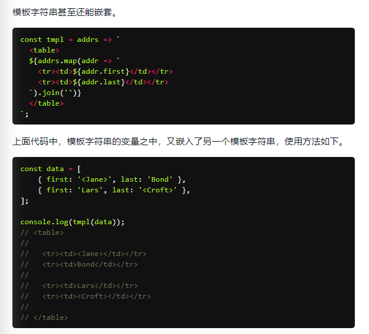
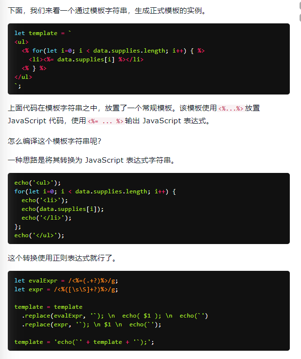
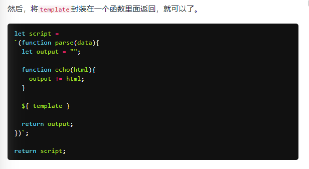
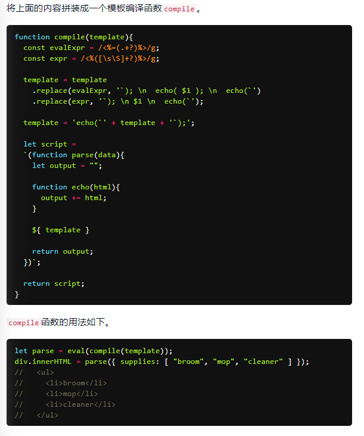
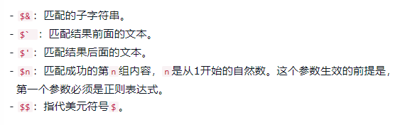

# ES6 学习笔记
## 第一阶段是快速过一遍简要记录下，第二阶段详细写笔记，参考资料[ES6 入门教程](https://es6.ruanyifeng.com/ "ES6 入门教程")
## 当前进度已完成至`5.正则的拓展`，下次看`6.数值的拓展`

### ECMAScript和JavaScript的关系？

### ES6的简史；ES5和ES6的区别；2013年ES6草案冻结，2015年ES6正式通过
PS：ES6 既是一个历史名词，也是一个泛指，含义是 5.1 版以后的 JavaScript 的下一代标准，涵盖了 ES2015、ES2016、ES2017 等等  
	而 ES2015 则是正式名称，特指该年发布的正式版本的语言标准  
	本书中提到 ES6 的地方，一般是指 ES2015 标准，但有时也是泛指“下一代 JavaScript 语言”。  

### Babel转码器；主要用于将ES6转译为ES5

### let命令；声明变量的技巧；避免变量提升；具有暂时性死区的特性；不允许重复声明

### ES6中的块级作用域与函数声明；虽然有规则但是为了老代码的兼容实际上做了一定妥协

### 立即执行函数表达式（匿名 IIFE）

### const命令；声明一个只读的常量，声明时就要赋值且之后不能再改变；const实际上保证的，并不是变量的值不得改动，而是变量指向的那个内存地址所保存的数据不得改动

### ES6声明变量的六种方法

### 顶层对象属性存在的问题以及ES6解决的方式

### globalThis对象以及设计这个对象的原因；ES2020 在语言标准的层面，引入globalThis作为顶层对象

### 变量的解构赋值；ES6 允许按照一定模式，从数组和对象中提取值，对变量进行赋值，这被称为解构（Destructuring）
+ 数组的解构赋值；模式匹配；Set结构也可以使用数组的解构赋值；只要某种数据结构具有`Iterator`接口都可以使用数组的解构赋值；解构赋值允许指定默认值
+ 对象的解构赋值；数据无序，对象必须要与属性同名；结构也可以用于嵌套结构；解构赋值允许指定默认值
+ 字符串的结构赋值，很有意思
+ 数值和布尔值的解构赋值，没看懂
+ 函数参数的解构赋值

### 变量解构赋值的用途；交换变量的值；从函数返回多个值；函数参数的定义；提取JSON值；函数参数的默认值；遍历Map结构；输入模块的指定方法
PS：这个最好每个都练习一下，在今后的生涯中对于自己代码的可读性非常有用

### 具有`Iterator`接口

### 字符串的拓展，这一章内容比较冷门或者我原来掌握的太少，理解起来比较耗时间，后期注意一下
+ 字符的Unicode表示法，完全不懂......  
+ 字符串新增了`Iterator`遍历器接口  
+ 字符串允许直接输入字符，以及输入字符的转义形式，完全不懂......  
+ 改造了JSON.stringify()，根据标准JSON的数据必须是UTF-8编码，但是该方法现在可能会返回不符合UTF-8标准的字符串  
+ 模板字符串，是增强版的字符串，用反引号（`）标识  
	> 模板字符串的空格和换行，都是被保留的，如果你不想要这个换行，可以使用`.trim()`方法消除它  
	> 它可以当作普通字符串使用，也可以用来定义多行字符串，或者在字符串中嵌入变量  
	> 嵌入变量需要将变量名写在`${}`之中，如果模板字符串中的变量没有声明，将报错  
	> `${}`大括号内部可以放入任意的 JavaScript 表达式，可以进行运算，以及引用对象属性，如果大括号内部是一个字符串，将会原样输出  
	> 模板字符串之中还能调用函数`function fn() {return "Hello World"}	(反引号)foo ${fn()} bar(反引号)`  
	> 模板字符串甚至还能嵌套  
	  
	> 如果需要引用模板字符串本身，在需要时执行，可以写成函数  
	> 模板字符串的应用实例：模板编译  
	  
	  
	 
	> 字符串模板还可以紧跟在一个函数名后面，该函数将被调用来处理这个模板字符串，这被称为***标签模板***功能，大致明白需要详细了解......
	> ***标签模板***的一个重要应用，就是过滤 HTML 字符串，防止用户输入恶意内容，另一个应用，就是多语言转换（国际化处理）
	> 模板字符串本身并不能取代 Mustache 之类的模板库，因为没有条件判断和循环处理功能，但是通过标签函数，你可以自己添加这些功能，没看懂......
	> 可以使用标签模板，在 JavaScript 语言之中嵌入其他语言（通过jsx函数，将一个 DOM 字符串转为 React 对象），牛逼，详细了解一下......
	> 但是字符串模板也是有一定的限制的，没看懂详细了解一下......

### 字符串对象新增的方法
+ `String.fromCharCode()`，用于从 Unicode 码点返回对应字符，不懂XD......
+ `String.raw()`，返回一个斜杠都被转义（即斜杠前面再加一个斜杠）的字符串，往往用于模板字符串的处理方法，还是不懂XD，评论区说写的有问题注意看下......
+ `String.codePointAt()`，对于这种4个字节的字符，JavaScript 不能正确处理，字符串长度会误判为2，`codePointAt()`方法，能够正确处理 4 个字节储存的字符，返回一个字符的码点
+ `String.normalize()`，许多欧洲语言有语调符号和重音符号，处理这个用的，不想了解......
+ 传统上，JavaScript 只有`indexOf()`方法，可以用来确定一个字符串是否包含在另一个字符串中，ES6 又提供了三种新方法
	> `String.includes()`，返回布尔值，表示是否找到了参数字符串  
	> `String.startsWith()`，返回布尔值，表示参数字符串是否在原字符串的头部  
	> `String.endsWith()`，返回布尔值，表示参数字符串是否在原字符串的尾部  
+ `String.repeat()`，返回一个新字符串，表示将原字符串重复n次
+ ES2017 引入了字符串补全长度的功能。如果某个字符串不够指定长度，会在头部或尾部补全
	> `String.padStart()`，用于头部补全  
	> `String.padEnd()`，用于尾部补全  
+ ES2019 对字符串实例新增了`trimStart()`和`trimEnd()`这两个方法，它们的行为与`trim()`一致
	> `String.trimStart()`，用于消除字符串头部的空格  
	> `String.trimEnd()`，用于消除字符串尾部的空格  
+ `String.matchAll()`，用于返回一个正则表达式在当前字符串的所有匹配，正则的拓展对此会有详细讲解注意下......
+ `String.replaceAll()`，历史上，字符串的实例方法replace()只能替换第一个匹配，ES2021 引入了replaceAll()方法，可以一次性替换所有匹配
	> `String.prototype.replaceAll(searchValue, replacement)`  
	> searchValue是搜索模式，可以是一个字符串，也可以是一个全局的正则表达式（带有g修饰符）  
	> 如果searchValue是一个不带有g修饰符的正则表达式，replaceAll()会报错，这一点跟replace()不同  
	> replaceAll()的第二个参数replacement是一个字符串，表示替换的文本，其中可以使用一些特殊字符串  
	
	
### 正则的拓展，我想直接忽略，因为正则我完全一窍不通，后期抽空专题学习研究下