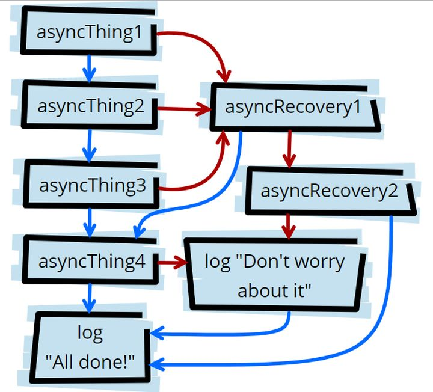

# 快速入门上手JavaScript中的Promise  


当我还是一个小白的时候，我翻了很多关于`Promise`介绍的文档，我一直没能理解所谓解决异步操作的痛点是什么意思  
直到我翻了谷歌第一页的所有中文文档我才有所顿悟，其实从他的英文字面意思理解最为简单粗暴  
这就是一个承诺，相当于在代码中提供一个在任何时候承诺之后要做什么事的方式，这个承诺可能会兑现也可能无法兑现，当然也可能在兑现的过程中  
用这个来替代我们曾经需要写的回调函数，可以避免JavaScript程序中的回调地狱  
所以先不去学习的语法，从另一个方式先理解，希望可以帮助你更好的学习或上手`Promise`


### 什么是Promise?
`Promise`是异步编程的一种解决方案，可以替代传统的解决方案，比如回调函数和事件  
其在ES6中统一了用法，并提供了原生的`Promise对象`，`Promise对象`表示异步操作的最终完成(或失败)及其结果值  
作为对象，`Promise`有以下两个特点：
1. 对象的状态不受外界影响  
	+ 只有异步操作的结果，可以决定当前是哪一种状态，任何其他操作都无法改变这个状态，
		这也是`Promise`这个名字的由来，它的英语意思就是承诺，表示其他手段无法改变  
2. 一旦状态改变了就不会在变，也就是说任何时候Promise都只有一种状态  
	+ `pending`：初始状态，不是成功或失败状态；
		`fulfilled(resolved)`：操作成功完成状态；
		`rejected`：操作失败状态  
	+ `Promise对象`的状态改变，只有两种可能：从`Pending`变为`Resolved`和从`Pending`变为`Rejected`，
		只要这两种情况发生，状态就凝固了，不会再变了，会一直保持这个结果，
		就算改变已经发生了，你再对`Promise对象`添加回调函数，也会立即得到这个结果，
		这与事件（Event）完全不同，事件的特点是，如果你错过了它，再去监听，是得不到结果的  
		
		
### Promise的创建和用途
1. 构造函数接受一个名为`executor`的函数，此执行函数接受两个`f函数`参数，`resolve`和`reject`。

```
new Promise( /* executor */ function(resolve, reject { ... }) );
```
2. Promise通常用于阻塞代码和异步操作，其中包括文件调用，API调用，DB调用，IO调用等等  
3. 这些异步操作的启动发生在执行函数中，如果异步操作成功，则通过`promise`的创建者调用`resolve()`函数返回预期结果，
	同样，如果出现意外错误，则通过调用`reject()`函数传递错误具体信息  
4. 由于`promise`会立即执行，我们无法检查`promise`的初始状态，所以创建一个需要时间执行的`promise`最简单的方式就是
	使用`setTimeOut()`函数，通过浏览器控制台的输出可以直观看到之前所说的状态，以及他的变化过程  

```
	var promiseFir = new Promise(function(resolve, reject) {
		setTimeout(function() {
			resolve({
				message: '与大家分享知识很开心！',
				code: 200
			});
		}, 2000)
	})
	console.log(promiseFir);
	setTimeout(function() {
		console.log(promiseFir);
	}, 2000)
```


### Promise的方法
1. 3种原型方法  
	+ [Promise.prototype.then(onFulfilled, onRejected) 链式操作](#jumpId-then)   
	+ [Promise.prototype.catch(onRejected) 捕捉错误](#jumpId-catch)  
	+ [Promise.prototype.finally(onFinally) 最终操作](#jumpId-finally)  
	+ 下面用一个小示例简单快速了解下这三个原型方法的用法
	
```
	// 用一个小故事举例，你是一个上学的孩子，你问你的妈妈要一个电话。她说: 这个月底我要买一部手机
	var momsPromise = new Promise(function(resolve, reject) {
		momsSavings = 20000;  // 因为妈妈没有足够储蓄所以无法买到礼物  
		// momsSavings = 200000;  // 如果妈妈有足够的储蓄就可以买到礼物
		priceOfPhone = 60000;
		if (momsSavings > priceOfPhone) {
			resolve({
				brand: "iphone",
				model: "6s"
			});
		} else {
			reject("我们没有足够的储蓄，让我们多存点钱吧。");
		}
	});
	momsPromise.then(function(value) {
		console.log("哇，我得到这个电话作为礼物 ", JSON.stringify(value));
	});
	momsPromise.catch(function(reason) {
		console.log("妈妈不能给我买电话，因为 ", reason);
	});
	momsPromise.finally(function() {
		console.log(
			"不管妈妈能不能给我买个电话，我仍然爱她"
		);
	});
```
2. 4种静态方法  
	+ [Promise.resolve()](#jumpId-resolve-reject)  
	+ [Promise.reject()](#jumpId-resolve-reject)  
	+ [Promise.all()](#jumpId-all)  
	+ [Promise.race()](#jumpId-race)  


<span id="jumpId-then"></span>
#### Promise.prototype.then(onFulfilled, onRejected) 链式操作
1. `Promise.prototype.then()`方法返回的是一个新的`Promise对象`，因此可以采用链式写法  
2. `Promise.prototype.then()`方法带有以下三个参数：成功回调，失败回调，前进回调，一般情况下只需要实现第一个，后面是可选的  

```
	function ptFir() {
		return new Promise(function(resolve, reject) {
			setTimeout(function() {
				console.log('方法1执行');
				resolve('方法1执行完毕');
			}, 2000)
		})
	}
	function ptSec() {
		return new Promise(function(resolve, reject) {
			setTimeout(function() {
				console.log('方法2执行');
				resolve('方法2执行完毕');
			}, 1000)
		})
	}
	function ptThi() {
		return new Promise(function(resolve, reject) {
			setTimeout(function() {
				console.log('方法3执行');
				resolve('方法3执行完毕');
			}, 3000)
		})
	}
	ptFir().then(function(data) {
		console.log('第一个回调：' + data);
		return ptSec();
	}).then(function(data) {
		console.log('第二个回调：' + data);
		return ptThi();
	}).then(function(data) {
		console.log('第三个回调：' + data);
		return '还没完？该结束了吧！';
	}).then(function(data) {
		console.log(data);
	})
```

<span id="jumpId-catch"></span>
#### Promise.prototype.catch(onRejected) 捕捉错误
1. `Promise.prototype.catch()`方法是`Promise.prototype.then(null, rejection)`的别名，用于指定发生错误时的回调函数  
2. `Promise对象`的错误具有**"冒泡"**性质，会一直向后传递，直到被捕获为止，也就是说，错误总是会被下一个`catch`语句捕获  

```
	promise().then(function(data) {
		// todo something
	}).catch(function(err) {
		// 处理上个回调函数的错误  
	})
```


<span id="jumpId-finally"></span>
#### Promise.prototype.finally(onFinally) 最终操作
不管`promise对象`最后的状态，在执行完`.then`或`catch`指定的回调函数以后，都会执行`finally`方法指定的回调函数  

```
	promise().then(function(data) {
		// todo something
	}).catch(function(err) {
		// 处理上个回调函数的错误  
	}).finally(function(result) {
		// 处理then/catch之后必须执行的操作
	})
```


<span id="jumpId-resolve-reject"></span>
#### Promise.resolve() / Promise.reject()  
1. 这两个是帮助方法或快捷方式，它们可以帮助您轻松创建`resolve`和`reject`方法  
2. 需要注意的是：如果`Promise.resolve()`方法的参数，
	不是具有`.then()`方法的对象（又称`thenable对象`），则返回一个新的`Promise对象`，且它的状态为`fulfilled`；
	如果`Promise.resolve`方法的参数是一个`Promise对象`的实例，则会被原封不动地返回  
3. `Promise.reject()`方法同上  

```
	var promise = Promise.resolve('Hello，这里是执行成功的内容！');
	// var promise = Promise.reject('出错了，这里是被发现的错误！');  // 成功和失败只会有一种状态哦  
	promise.then(function(data) {
		console.log(data)
	});
	promise.catch(function(err) {
		console.log(err)
	});
```


<span id="jumpId-all"></span>
#### Promise.all()  
1. 当你处理多个`promise`时，最好先创建一个`promise数组`，然后对这些`promise集`执行必要的操作  
2. `Promise.all(iterable) 方法`返回一个`Promise实例`，此实例在`iterable参数`内所有的`promise`  
3. 都完成（resolved）或参数中不包含`promise`时回调完成（resolve）  
4. 如果参数中`promise`有一个失败（rejected），此实例回调失败（reject），失败原因的是第一个`失败promise`的结果  
5. ***注意!!!***这里的异步操作是并行执行的，等到它们都执行完后才会进到`then()`里面，
	并且`all()`方法会把所有异步操作的结果放进一个数组中传给`then()`
6. ***下面的示例需要说明的内容***
	+ 只有3个方法的状态都变成`fulfilled`，p的状态才会变成`fulfilled`，此时3个方法的返回值组成一个数组，传递给p的回调函数  
	+ 只要3个方法之中有一个被`rejected`，p的状态就变成`rejected`，此时第一个被`reject`的实例的返回值，会传递给p的回调函数  
	
```	
	function ptFir() {
		return new Promise(function(resolve, reject) {
			setTimeout(function() {
				console.log('方法1执行');
				resolve('方法1执行完毕');
			}, 2000)
		})
	}
	function ptSec() {
		return new Promise(function(resolve, reject) {
			setTimeout(function() {
				console.log('方法2执行');
				resolve('方法2执行完毕');
			}, 1000)
		})
	}
	function ptThi() {
		return new Promise(function(resolve, reject) {
			setTimeout(function() {
				console.log('方法3执行');
				resolve('方法3执行完毕');
			}, 3000)
		})
	}
	Promise.all([ptFir(), ptSec(), ptThi()]).then(function(data) {
		console.log(data);
		console.log({}.toString.call(data));
	})
```


<span id="jumpId-race"></span>
#### Promise.race()  
1. `Promise.race(iterable)`方法返回一个`promise`，一旦迭代器中的某个`promise`解决或拒绝，返回的`promise`就会解决或拒绝  
2. `all()`方法的效果实际上是**「谁跑的慢，以谁为准执行回调」** ，
	那么相对的就有另一个方法**「谁跑的快，以谁为准执行回调」**，这就是`race()`方法，这个词本来就是赛跑的意思  
3. 这个`race()`方法有什么用呢？使用场景还是很多的，比如我们可以用`race()`给某个异步请求设置超时时间，
	并且在超时后执行相应的操作  
	
```
	// ptFir(), ptSec(), ptThi() 同上
	Promise.all([ptFir(), ptSec(), ptThi()]).then(function(data) {
		console.log(data);
		console.log({}.toString.call(data));
	})
```

### 使用Promise的一些经验法则  
1. 进行异步操作或使用阻塞代码时，请使用`Promise`  
2. 为了代码的可读性，`resolve()`方法对待`.then()`, `reject()`方法对应`.catch()`  
3. 确保同时写入`.catch()`和`.then()`方法来实现所有的`promise`  
4. 如果在这两种情况下都需要做一些事情，请使用`.finally()`  
5. 我们只有一次改变每个`promise (单一原则)`  
6. 我们可以在一个`promise`中添加多个处理程序  
7. `Promise对象`中所有方法的返回类型，无论是静态方法还是原型方法，都是`Promise`  
8. 在`all()`方法中，无论哪个`promise`首先未完成，`promise`的顺序都保持在值变量中  

	
[参考文档一  ———— 彻底理解Javascript 中的 Promise](https://blog.csdn.net/weixin_34273479/article/details/86352877)  
[参考文档二  ———— 通俗浅显的理解Promise中的then](https://zhuanlan.zhihu.com/p/98383032)  
[参考文档三  ———— 理解 Javascript 中的 Promise](https://segmentfault.com/a/1190000017312249)  
[参考文档四  ———— JavaScript Promise 对象](https://www.runoob.com/w3cnote/javascript-promise-object.html)

