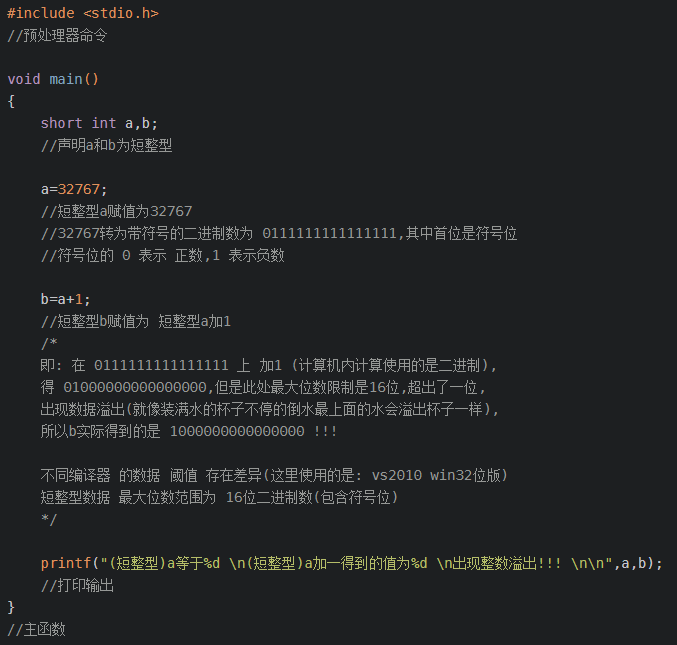

# JavaScript语言精粹 读书笔记

## 为什么要是用JavaScript?
老道（该书的作者）认为写一本关于`DOM`精华的书就像执行一项不可能完成的任务  

## 分析JavaScript
+ JavaScript有非常强大的对象字面量表示法，通过列出对象的组成部分，就可以轻松创建对象，这是`JSON`的灵感来源  
+ 原型继承和使用类去创建对象的语言来说非常不同，但是如果你学会了自如使用JavaScript原型，这会非常nice  
+ 全局变量是魔鬼，非常糟糕，所有编译单元的顶级变量被撮合到一个被称为全局对象的公共命名空间中  

## 本书贯彻始终都会用一个`method`方法去定义新方法  
```
Function.prototype.method = function(name,func){
	this.prototype[name] = func;
	return this;
}
```

## 空白（Whitespace）
空白通常没有意义，但是有时候必须要用它赖分隔字符序列，例如`var that = this;`  

## 注释（Notes）
`/* */`块注释可能会导致语法错误，所以较为常见的是用`//`行注释  
```
var rm_a = /a*/.match(s);
```

## 标识符（Names）
+ 标识符由一个字母开头，其后可选择性地加上一个或多个字母、数字和下划线，但是标识符不能使用保留关键字  
+ 值得注意的是，JavaScript不允许使用点运算符提取，使用保留关键字作为对象的属性名  

## 数字（Numbers）
+ JavaScript只有一个数字类型，它在内部被表示为64位的浮点数，所以`1`和`1.0`的值是相同的，这样避免的短整型的溢出问题  
+ `NaN`是一个数值，它表示一个不能产生正常结果的运算结果，`NaN`不等于任何值，包括它自己，所以只能用`isNaN()`检测`NaN`  
+ 如果把`NaN`与任何值（包括其自身）相比得到的结果均是`false`，所以要判断某个值是否是`NaN`，不能使用`==`或`===`运算符。正因为如此，`isNaN()`函数是必需的  
+ `Infinity`表示所有大于`1.79769313486231570e+308`的值

### 关于短整型的溢出问题
  

## 字符串（Strings）
